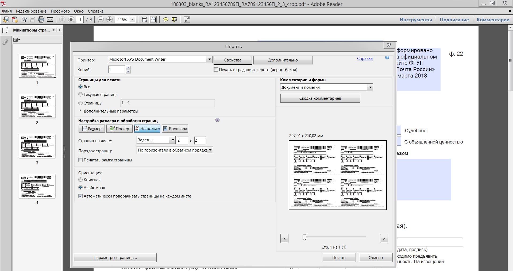

# pochtaru_tools

## Описание

Скрипт для обрезки PDF извещений созданных на сайте Почты России pochta.ru
Если правильно настроить параметры в диалоге печати Adobe Reader'а, то можно распечатывать по 4 шт. стандартных извещений на одном листе A4

## [Скачать](https://github.com/KiberInfinity/pochtaru_tools/releases/latest)

Если вникать в скрипт и установливать Python и pyPdf не интересно, можно скачать сборку скрипта как Winows-приложение (создано через cx_freeze):

**[СКАЧАТЬ](https://github.com/KiberInfinity/pochtaru_tools/releases/latest)**

В архиве приложены два файла `rupost_crop_frontpage.bat` и `rupost_crop_backpage.bat` для преобразования  фронтальных и задних страниц уведомлений соответственно.
Для их использования можно просто выделить  несколько PDF-файлов с извещениями и перетащить их на нужный bat'ник:

Рекомендуется использоваться вместе с UserScript форматирования имени скачиваемого с сайта почты файла заполненного извещения (подробности ниже.)

## Подробности

В качестве аргументов скрипту `rupost.py` передаём имена PDF-файлов полученных в результате заполнения извещения формы 22 на сайте Почты России.
На выходе получаем в одном файле первые страницы извещения.

Если же нам нужна сборка из оборотных сторон извещения, где указываются паспортные данные, то первым аргументом передаём аргумент `backpage`, а следом имена исходных PDF-файлов

Для работы скрипта нужна установленная библиотека [pyPdf 1.13](https://pypi.python.org/pypi/pyPdf) (не требуется для standalone сборки скрипта для Windows)

## UserScript
Желательный формат имён входных PDF-файлов извещений:
`ГодМесяцДата_blanks_НомерТрека.pdf (Например 180224_blanks_RA123456789CN.pdf)`

Для того, чтобы скачивать извещения сразу с таким именем файла, то можно установить [rupost_dl_name.user.js](rupost_dl_name.user.js) для [TamperMonkey](http://tampermonkey.net/) 

